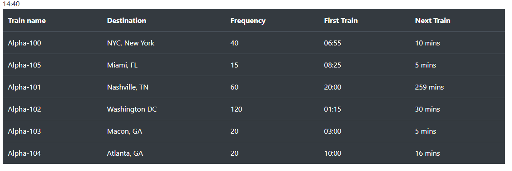

# TrainScheduler

View:

Purpose:

- This app is to add trains to schedule along with there frequency to always keep track on the next train.

# Instructions

How to get started:

- Open the app the current time is displayed on the top of the screen for yout convience.
- Fill out the form starting with the train name. Train name should start with Alpha - then add a 3 digit number.

### Future Scope:

*   Add a delete funntion.

* Have the next train times more precise.

* Add More unique styling for more trains and different start times for the same destination
